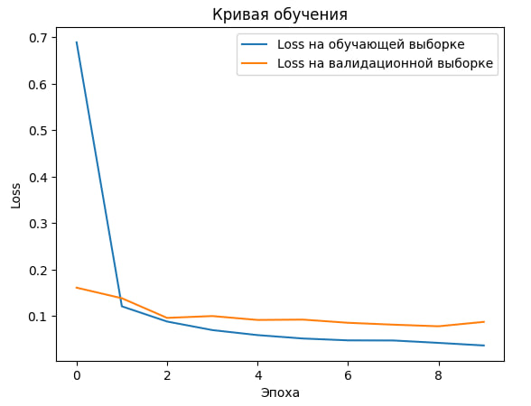

# digit-recognizer
Распознавание рукописных цифр из MNIST с помощью сверточной нейронной сети.
### Стэк технологий
**Препроцессинг:** pandas — подготовка данных.

**Валидация модели:** scikit-learn — разделение данных на train/val.

**Нейронные сети:** PyTorch.

**Визуализация:** matplotlib — построение кривой обучения.

### Результаты



### Запуск проекта
1. Клонирование репозитория
  
	```bash
	git clone https://github.com/sofiachuleva/digit-recognizer.git
	cd digit-recognizer
	```
3. Датасет
    
	Скачайте датасет с Kaggle по ссылке: https://www.kaggle.com/competitions/digit-recognizer/data.

	Поместите файлы `train.csv` и `test.csv` датасета в папку `data/` внутри репозитория.
4. Создание виртуального окружения
	```bash 
	python -m venv venv
	```
5. Активация окружения

	Для Mac/Linux:
	```bash 
	source venv/bin/activate
	```
	Для Windows в cmd:
	```bash 
	venv\Scripts\activate
	```
	Для Windows в Git Bash:
	```bash
	source venv/Scripts/activate
 	```
6. Установка зависимостей
	```bash 
	pip install -r requirements.txt
	```
7. Запуск Jupyter Notebook
	```bash 
	jupyter notebook
	```
	Далее, откройте `digit-recognizer.ipynb` и запустите все ячейки последовательно.
